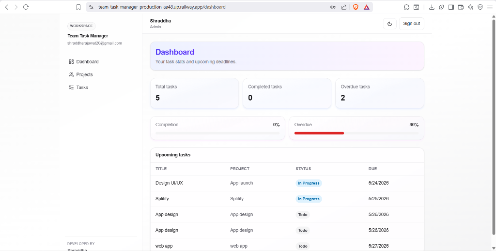
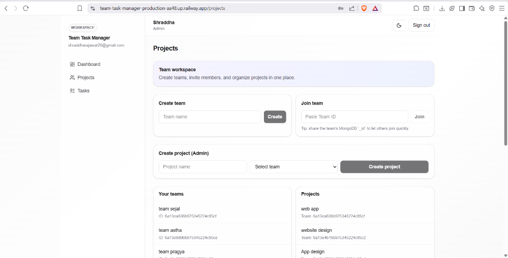
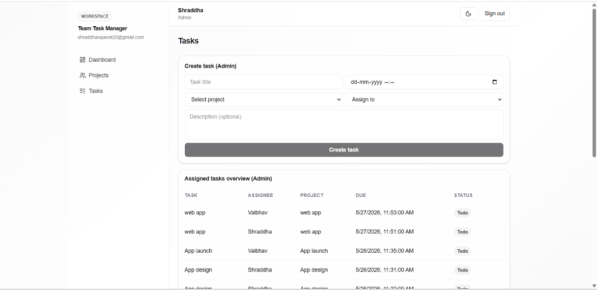
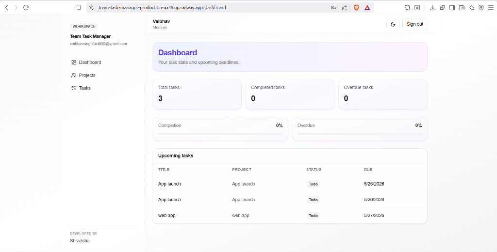

# Team Task Manager

Modern full-stack Team Task Manager built with Next.js App Router, NextAuth, MongoDB, and role-based workflows for Admin and Member users.

### 🌐 Live Demo: [https://team-task-manager-production-aa48.up.railway.app](https://team-task-manager-production-aa48.up.railway.app)

---

## Developer

**Shraddha**

---

## Highlights

- Secure auth with credentials (email/password) and bcrypt hashing
- Role-based access control (`admin` / `member`)
- Team and project management
- Task assignment + status tracking (`Todo`, `In Progress`, `Done`)
- Admin overview for assigned work monitoring
- Dashboard with totals, overdue count, and progress indicators
- Attractive gradient UI, dark/light mode, hover interactions, toasts
- Forgot password + reset password flow (SMTP-based)

---

## Tech Stack

- **Framework:** Next.js (App Router), React, TypeScript
- **Auth:** NextAuth (Credentials)
- **Database:** MongoDB + Mongoose
- **Validation:** Zod
- **Styling:** Tailwind CSS v4
- **Notifications:** React Hot Toast

---

## Core Features

### Authentication
- Signup with name/email/password
- Separate Member and Admin login pages
- Email normalization (lowercase handling)
- Forgot/Reset password flow

### Role-Based Permissions
- **Admin**
  - Create projects
  - Assign tasks
  - Monitor team tasks from admin overview
- **Member**
  - View only assigned tasks
  - Update own task status

### Team & Project Flow
- Create team
- Join team using team ID
- Create projects under teams

### Task Management
- Create and assign tasks
- Due date support
- Status updates with live UI refresh
- Overdue highlighting

---

## Folder Structure

- `src/app/(app)` - protected app pages (`dashboard`, `projects`, `tasks`)
- `src/app/api` - REST API routes
- `src/models` - Mongoose models
- `src/lib` - db, auth, helper utilities
- `src/auth.ts` - NextAuth config

---

## Environment Variables

Copy `.env.example` to `.env.local`:

```bash
cp .env.example .env.local
```

Then configure:

```env
MONGODB_URI=
NEXTAUTH_SECRET=
NEXTAUTH_URL=http://localhost:3000

# optional for reset-password emails
APP_URL=http://localhost:3000
SMTP_HOST=smtp.gmail.com
SMTP_PORT=465
SMTP_USER=your_email@gmail.com
SMTP_PASS=your_app_password
SMTP_FROM="Team Task Manager <your_email@gmail.com>"
```

---

## Run Locally

```bash
npm install
npm run dev
```

Open: `http://localhost:3000`

Health check: `http://localhost:3000/api/health`

---

## API Overview

### Auth
- `POST /api/auth/register`
- `GET/POST /api/auth/[...nextauth]`
- `GET /api/auth/exists`
- `POST /api/auth/forgot-password`
- `POST /api/auth/reset-password`

### Teams
- `GET /api/teams`
- `POST /api/teams`
- `POST /api/teams/:teamId/join`

### Projects
- `GET /api/projects`
- `POST /api/projects` (admin)

### Tasks
- `GET /api/tasks`
- `POST /api/tasks` (admin)
- `PATCH /api/tasks/:taskId/status`

### Users
- `GET /api/users?teamId=...`
- `GET /api/users` (admin)

---


Build and start commands:

```bash
npm run build
npm run start
```

---

## Screenshots

### Admin View

<p align="center">
  
  
</p>
<p align="center">
  
</p>

### Member View

<p align="center">
  
</p>

---

## License

For personal/educational use.


